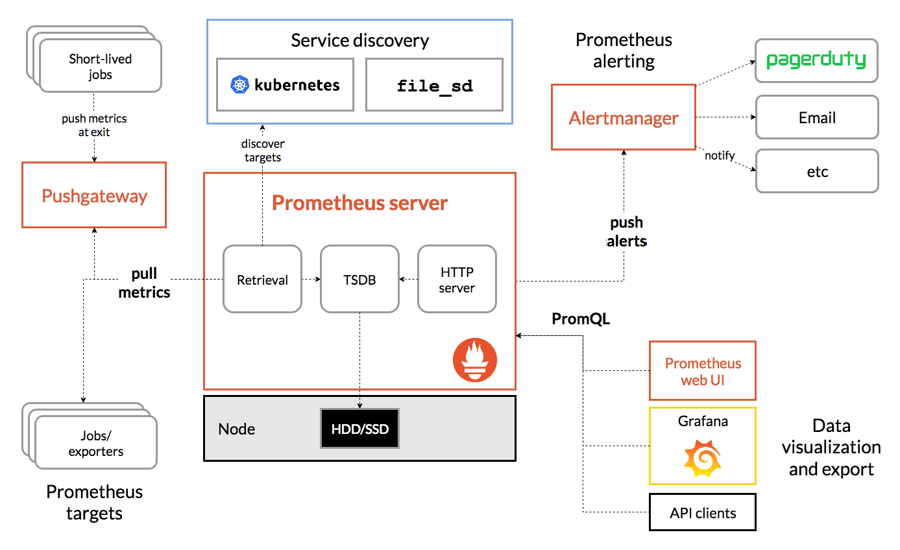

# Hands-On Software Engineering With Golang - Achilleas Anagnostopoulos
## Overview

## Chapter 13: Metrics Collection and Visualization
Converting monolithic applications into a set of microservices requires monitoring the health of each individual service and being notified when problems arise.

- Prometheus: a popular metrics collection system written entirely in Go.

covered topics:
- Explaining the differences between essential SRE terms such as SLIs, SLOs, and SLAs
- Comparison of push- and pull-based systems for metrics collection and an analysis of the pros and cons of each approach
- Setting up Prometheus and learning how to instrument your Go applications for
collecting and exporting metrics
- Running Grafana as the visualization frontend for our metrics
- Using the Prometheus ecosystem tools to define and handle alerts

### Monitoring from the perspective of a site reliability engineer

monitoring the state and performance of software systems is one of the key responsibilities associated with the role of a site reliability engineer (SRE).    
**Service-level indicators (SLIs)**: An SLI is a type of metric that allows us to quantify the perceived quality of a service from the perspective of the end user.  
some common types of SLIs:
- Availability
- Throughput
- Latency

**Service-level objectives (SLOs)**: An SLO is defined as the range of values for an SLI that allows us to deliver a particular level of service to an end user or customer.  
SLO definitions generally consist of three parts:
- a description of the thing that we are measuring (the SLI)
- the expected service level expressed as a percentage
- the period where the measurement takes place

Service-level agreements (SLAs): An SLA is an implicit or explicit contract between a service provider and one or more
service consumers. The SLA outlines a set of SLOs that have to be met and the
consequences for both meeting and failing to meet them.

### Exploring options for collecting and aggregating metrics
Monitoring and metrics aggregation systems can be classified into two broad categories based on the entity that initiates the data collection:
- In a push-based system, the client (for example, the application or a data collection service running on a node) is responsible for transmitting the metrics data to the metrics aggregation system.
- In a pull-based system, metrics collection is the responsibility of the metrics aggregation system. In an operation commonly referred to as scraping the metrics system initiates a connection to the metrics producers and retrieves the set of available metrics.

In a pull-based system, the ingestion rate for metrics is under the control of the collector. Collectors can react to sudden spikes in metric production rates by adjusting their scrape rates to compensate. Pull-based systems are generally considered to be more scalable than their push-based counterparts.  

pull-based metrics system assumes that the collector can always establish a connection to the
various endpoints. However, this may not always be possible! Consider a scenario where
we want to scrape a service that has been deployed to a private subnet. That particular
subnet is pretty much locked down and does not allow ingress traffic from the subnet that
the collector is deployed to. In such a case, our only option would be to use a push-based
mechanism to get the metrics out (while ingress traffic is blocked, egress traffic is typically
allowed).  

### The Prometheus architecture

- The **Prometheus server** is the core component of Prometheus. Its primary responsibility is to periodically scrape the configured set of targets and persist any collected metrics into a time-series database. As a secondary task, the server evaluates an operator-defined list of alert rules and emits alert events each time any of those rules are satisfied. 
- The **Alertmanager component** ingests any alerts emitted by the Prometheus server and sends notifications through one or more communication channels (for example, email, Slack, or a third-party pager service).
- The **service discovery layer** enables Prometheus to dynamically update the list of endpoints to scrape.
- The **Pushgateway component** emulates a push-based system for collecting metrics from sources that cannot be scraped.
- Clients retrieve data from Prometheus by submitting queries written in a
bespoke query language referred to as **PromQL**.

### metric types
- **Counters**: A counter is a cumulative metric whose value increases monotonically over time. Counters can be used to track the number of requests to a service, the number of downloads for an application, and so on.
- **Gauges**: A gauge tracks a single value that can go up or down. A common use case for gauges is to record usage (for example, CPU, memory, and load) stats about a server node and metrics such as the total number of users currently connected to a particular service.
- **Histograms**: A histogram samples observations and assigns them to a preconfigured number of buckets.
- **Summaries**: Summaries perform quantile calculations directly on the client and can be used as an alternative for reducing the query load on the server.

### automating the detection of scrape targets
A **static scrape configuration** is considered the canonical way of providing scrape targets to
Prometheus. The operator includes one or more static configuration blocks in the
Prometheus configuration file that define the list of target hosts to be scraped and the set of
labels to apply to the scraped metrics.  

A better alternative is to extract the static configuration blocks to an external file and then reference that file from within the Prometheus configuration. When file-based discovery is enabled, Prometheus will watch the specified set of files for changes and automatically reload their contents once a change has been detected.

### Instrumenting Go code 
In order for Prometheus to be able to scrape metrics from our deployed services, we need to perform the following sequence of steps:
1. Define the metrics that we are interested in tracking.
2. Instrument our code base so that it updates the values of the aforementioned metrics at the appropriate locations.
3. Collect the metric data and make it available for scraping over HTTP. 

**promauto** is a subpackage of the Prometheus client that defines a set of convenience helpers for creating and registering metrics with the minimum possible amount of code. Each of the constructor functions from the promauto package returns a Prometheus metric instance that we can immediately use in our code.
